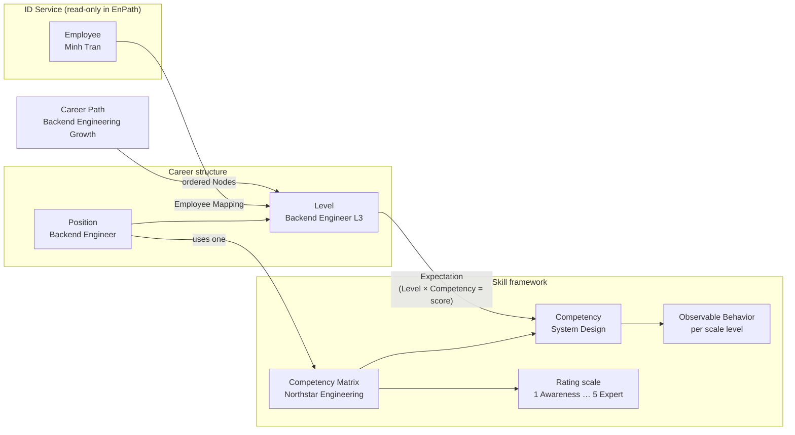
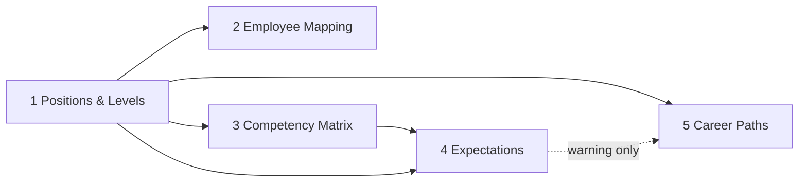

#enpath #glossary

# EnPath glossary and data model

Plain-language definitions of the Setup terms. Example values come from the prototype (Northstar tenant).
Where the PRDs disagree, both versions are listed. Neither is confirmed.

## How the pieces connect



Read it as: an **Employee** sits on a **Level**. The Level belongs to a **Position**. The Position uses a
**Matrix** of **Competencies**. An **Expectation** says what score each Level needs in each Competency.
A **Career Path** strings Levels together into allowed moves.

## Setup order



Steps can be done partially and out of order; the system warns, it does not block (PRD-018 §3).

## Glossary

| Term | Plain meaning | Example | Notes |
|---|---|---|---|
| **Position** | A job family | Backend Engineer (code `BE`) | Name and code unique per company. Status: **Draft / Published** (Published = read-only; Unpublish is the only way back) |
| **Level** | A step within a Position, ordered by sequence | Backend Engineer L3 | Belongs to exactly one Position. Also called a **Position-Level** |
| **Employee Mapping** | Which Level a person is on today, inside EnPath | Minh Tran → Backend Engineer L3 | Changes only the EnPath assignment, never HR data |
| **ID Service** | The company's HR system; owns names, titles, org units, managers | "Employment title: VP of Engineering" | Read-only in EnPath. Title ≠ Position |
| **Competency Matrix** | A reusable skill framework with its own rating scale | Northstar Engineering Matrix | Must be Active to be used. One Position uses one Matrix; many Positions can share one. **No versions** (2026-09-28): Duplicate makes a new, independent Matrix ("A" → "A1") |
| **Competency** | One skill in a Matrix | System Design | |
| **Rating scale** | The score range for every Competency in a Matrix | 1 Awareness · 2 Working · 3 Proficient · 4 Advanced · 5 Expert | ⚠ PRD-018: 3, 4 or 5 named levels. PRD-001: any integer 1–10, locked after creation, names optional |
| **Observable Behavior** | What a score looks like in practice, per **point** of the scale (never "level") | System Design at 4: "Can lead system design for complex services" | |
| **Expectation** (Expected Competency) | The score a Level requires in a Competency | Backend L4 needs System Design = 4 | One cell in the Level × Competency grid. Can be "Not set". Must not go down as Levels go up |
| **Expected cell** | One square of that grid | Backend: 3 Levels × 6 Competencies = 18 cells | Unit used for completeness on the Expectations screen |
| **Career Path** | An ordered list of allowed moves between Levels | L2 → L3 → L4 | 2+ Nodes. Can cross Positions (Engineer → Manager). ⚠ Status: PRD-018 Draft/Active/Archived + version; PRD-003 Draft/Active only, no version |
| **Node** | One stop on a Career Path; always a Position + Level | Backend Engineer L3 | "Expectation-ready" = all its cells are set |
| **Target** | The Level an employee chooses to aim for — shown as **Active target** in My Career | Lan aims for Backend Engineer L3 | Not part of Setup, but Setup exists to make it possible. See My Career terms |
| **Gap** | Difference between a person's score and the Target's Expectation | System Design: has 3, needs 4 | Why Expectations matter. **Employee UI says "Growth area"** (tone guide: development information, not a verdict); "gap" is for docs, manager, admin and analytics views |
| **Preview → Confirm** | Every important change shows before/after first, then saves on confirm | "Preview mapping change" | Called a **governed write** in the docs |
| **Audit log** | Record of every confirmed change | Feeds "Recent Admin activity" | ⚠ Required in PRD-018, out of scope in PRD-001/002/003 |
| **Tenant** | One customer company | Northstar | All data must stay inside one tenant |

## My Career terms

The employee side. How they look on the map: `my-career-build.md` → "How the map works".

| Term                                    | Plain meaning                                                                                                              | Example                                                                               | Notes                                                                                                                                                                                                                                                                                                                             |
| --------------------------------------- | -------------------------------------------------------------------------------------------------------------------------- | ------------------------------------------------------------------------------------- | --------------------------------------------------------------------------------------------------------------------------------------------------------------------------------------------------------------------------------------------------------------------------------------------------------------------------------- |
| **You are here**                        | The employee's current Level, from Employee Mapping                                                                        | Lan → Backend Engineer L2 · Mid                                                       | Official role; only the admin changes it                                                                                                                                                                                                                                                                                          |
| **Active target**                       | The one Level the employee works toward                                                                                    | Backend Engineer L3 · Senior                                                          | Chosen by the employee alone, no approval. Changing it never changes the official role                                                                                                                                                                                                                                            |
| **Company path**                        | A published Career Path that includes the employee's current Level                                                         | Engineering growth                                                                    | Planned by the company — following one or targeting a Level on it needs no approval                                                                                                                                                                                                                                               |
| **Path you follow**                     | The company path the employee picked as their main route                                                                   | "Engineering growth · you follow"                                                     | Top row of the map, drawn green. Switch with the "Following" picker or "Follow this path" (no "stop following": removed 2026-09-28)                                                                                                                                                                                                                                            |
| **Planned**                             | A Level ahead on the followed path, or added from another company path                                                     | Backend Engineer L4 · Staff                                                           | Can become the Active target                                                                                                                                                                                                                                                                                                      |
| **Completed**                           | A Level before You are here on the followed path                                                                           | Backend Engineer L1 · Junior                                                          | No actions                                                                                                                                                                                                                                                                                                                        |
| **Career vision**                       | The employee's own drafted path outside their company paths                                                                | Backend L2 → Product Designer L1 → L2                                                 | Private until sent; the manager approves before a role in it can be the target. Any number; one request open at a time. Numbered ("Career vision 2") when there are several                                                                                                                                                       |
| **Request**                             | Sending a Career vision for approval                                                                                       | Draft → Waiting for approval → Approved / Declined                                    | Can be withdrawn while waiting. UI never names the manager — "your manager"                                                                                                                                                                                                                                                       |
| **Route**                               | Any line on the map: a company path or a Career vision                                                                     | —                                                                                     | Coloured by role: followed = green, other company path = grey, Career vision = dashed violet                                                                                                                                                                                                                                      |
| **Explore a position**                  | The one way to add roles to the map                                                                                        | Join Product Manager at L2                                                            | Says whether it's company-path steps (no approval) or a Career vision                                                                                                                                                                                                                                                             |
| **New on your path** | A level a company path added behind the employee's current level that they never held | Frontend Engineer L1 added to Engineering growth on 27 Sep | Not Completed (Completed comes from Levels held, not path order). Becomes Completed via an approved Assessment or the manager. Shown as a card status and in Path history |
| **Ready · Growth area · Not assessed yet** | A competency's status against the role you're looking at                                                                   | Code quality 3 → 4 = Growth area                                                      | **Growth area** is the employee-facing word for a gap (never "gap" in the employee UI). "Not assessed yet" = no approved Assessment score yet — never a gap (was "Needs records" until 2026-09-28; scores come from Assessment, see below). No readiness %                                                                                             |
| **Assessment**                          | A periodic check of where the employee is: a score per competency                                                          | H2 2026 · Senior Software Engineer · 3 competencies                                   | The **only source of scores**. Per employee, per target role, per period (H1/H2, growth check-in), covering a chosen set of competencies. Employee self-assesses → line manager reviews → **Completed** (approved). The latest Completed score per competency is "you" in every comparison. Scores belong to the employee × competency, not to a path step, so they survive path changes. No PRD yet → `my-assessment-build.md` |
| **Growth area**                         | A competency where the score is below what the role needs                                                                  | Stakeholder management 2 → 3                                                          | Employee-facing name for a **gap** (tone guide: development information, not a verdict)                                                                                                                                                                                                                                           |
| **Action plan / Action**                | The employee's plan of work to close growth areas; an Action is one piece of work tied to one growth area, with a due date | "Facilitate a stakeholder session" · Growth area: Stakeholder management · due 11 Oct | My Actions (PRD-022). Kanban To do → In progress → Done. **The employee creates, edits and works in it; the manager sees it and approves.** AI proposes actions; a person adds them ("Add to plan") → `my-actions-build.md`                                                                                                       |
| **Record** (evidence) | Proof of work the employee keeps: feedback, project notes, links, files | Notes and feedback from "Lead a design review" | **My Records** page, **kept** (2026-09-28, reverses dropping it). Added when an Action moves to Done, or on its own. Never a score by itself: it's the evidence for the next Assessment. AI reads records to propose Actions and, when a role uses another Matrix, to suggest scores (manager confirms). Records are never lost: they keep their history and can count toward any later role with a similar competency |
| **Suggested score** | A score AI proposes for a competency that has no approved score, from a **similar competency** in another Matrix plus the employee's records and actions | "Design systems: suggested 1 · Awareness, based on 'Learn design system basics' (done 12 Sep)" | Used when a role uses a different Matrix (e.g. You are here moves to C′). Shown as "Suggested" and **not counted** until the manager confirms (can confirm in bulk). Decided 2026-09-28 (B1): AI proposes, a person decides |
| **Competency library** | Competencies shared across Matrices, so the same skill keeps one identity | "Testing" used by Engineering and QA matrices | **Future, not built.** Today each Matrix has its own competencies (Duplicate makes new ones), so cross-Matrix matching goes through Suggested scores |

### How the pieces fit — the development loop

```
Target ──▶ Assessment ──▶ Growth areas ──▶ Action plan ──▶ Records
(where I     (where I am:    (target minus     (work to close   (proof of the
 want to go)  scores)         scores)           them)            work done)
                 ▲                                                  │
                 └──────────── used in the next Assessment ◀────────┘
```

**Assessment = the score. Record = the proof (evidence). Action = the plan.** Growth areas are computed, never
entered by hand.

## Words to keep out of the UI

Engineering terms from the prototype that users shouldn't have to learn: *governed writes*, *expected cells*,
*cross-position*, *nodes*, *tenant*. Candidates for plainer copy in the redesign.
